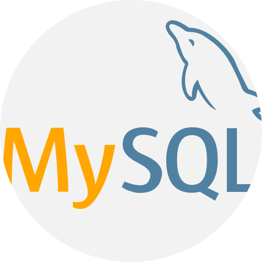

<h1 align="center">Hi there, my name is Bruno Ferreira 👋</h1>

Here are some ideas to get you started:

- 🔭 I’m currently working on ...
- 🌱 I’m currently learning ...
- 👯 I’m looking to collaborate on ...
- 🤔 I’m looking for help with ...
- 💬 Ask me about ...
- 😄 Pronouns: ...
- ⚡ Fun fact: ...
-->

#### 📫 How to reach me: srbrunoferreira@outlook.com
#### 💻 See my website: https://srbrunoferreira.000webhostapp.com/
#### 🤵 My LinkedIn: https://www.linkedin.com/in/brunoferreiradc
#### ⚡ My skills:      
#### 🤔 I'm looking for: friends to share knowledge and do great projects.

## Languages & Technologies

-->
